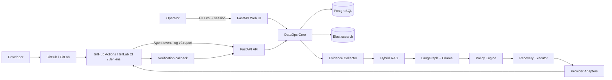

# Nền tảng DataOps đa nền tảng tích hợp AI Agent

> Tên đề tài dự kiến: **Xây dựng nền tảng DataOps đa nền tảng tích hợp AI Agent và Hybrid RAG để phân tích, phục hồi sự cố pipeline dữ liệu**.

Đây là một **DataOps control plane** độc lập với công cụ CI/CD. Hệ thống kết nối với GitHub Actions, GitLab CI, Jenkins và Kubernetes thông qua các provider adapter; theo dõi vòng đời pipeline dữ liệu; thu thập log, Data Quality report và thông tin phiên bản; sau đó hỗ trợ phát hiện, phân tích nguyên nhân và phục hồi sự cố an toàn.

GitHub Actions được chọn làm provider đầu tiên cho MVP. Kiến trúc lõi không phụ thuộc GitHub, vì vậy có thể bổ sung GitLab CI hoặc Jenkins mà không phải viết lại Agent, Policy Engine và quy trình xử lý incident.

Sản phẩm gồm hai phần độc lập:

- [`dataops-agent`](https://github.com/AndyAnh174/dataops-agent) chạy trong CI/CD để thực
  thi pipeline portable và gửi event/log/report.
- `dataops-platform` là bộ self-hosted gồm FastAPI API, Web UI, PostgreSQL và
  Elasticsearch. FastAPI phục vụ cả API lẫn HTML/CSS/JavaScript; dự án không thêm một
  Express backend trung gian trong MVP.

## Mục tiêu

- Chuẩn hóa cách theo dõi pipeline giữa nhiều nền tảng CI/CD.
- Tự động thu thập bằng chứng khi pipeline dữ liệu gặp lỗi.
- Dùng Agentic Hybrid RAG để hỗ trợ phân tích nguyên nhân gốc (RCA).
- Đề xuất hoặc thực hiện có kiểm soát các hành động `RETRY`, `QUARANTINE`, `ROLLBACK` và `CREATE_PR`.
- Xác minh lại pipeline và chất lượng dữ liệu sau khi phục hồi.
- Giảm MTTD, MTTR và thời gian kỹ sư phải đọc log thủ công.

## Hệ thống không phải là gì?

- Không thay thế GitHub Actions, GitLab CI hay Jenkins.
- Không cho LLM tự do thao tác production.
- Không tự merge code hoặc sửa trực tiếp dữ liệu production trong MVP.
- Không chạy LLM trên mọi commit; Agent chỉ được kích hoạt khi có lỗi hoặc anomaly cần phân tích.

## Kiến trúc tổng quan



## Luồng cốt lõi

```text
Push code
→ CI kiểm thử và build image
→ DataOps theo dõi trạng thái
→ Pipeline thành công: verification và publish
→ Pipeline thất bại: tạo incident
→ thu thập bằng chứng
→ Hybrid RAG + AI Agent tạo RCA
→ Policy Engine kiểm tra hành động
→ Recovery Executor retry/quarantine/rollback
→ Verification Job chạy lại
→ resolved hoặc chuyển cho con người
```

## Tech stack dự kiến

| Nhóm | Công nghệ |
|---|---|
| Backend và Web UI | Python 3.11+, FastAPI, Jinja2, HTML/CSS/JavaScript |
| Validation và persistence | Pydantic, SQLModel/SQLAlchemy, PostgreSQL |
| Metadata database | PostgreSQL |
| Data pipeline | Pandas |
| Data Quality | Great Expectations |
| Anomaly detection | Scikit-learn, Isolation Forest |
| Search và log | Elasticsearch Data Stream, Kibana; Logstash/Elastic Agent tùy chọn |
| Agent và LLM | LangGraph, Ollama |
| Metrics | Prometheus, Grafana |
| Container và runtime | Docker Compose; K3s/Kubernetes là hướng mở rộng |
| CI/CD đầu tiên | GitHub Actions |
| CI/CD mở rộng | GitLab CI, Jenkins |
| GitOps | Argo CD, triển khai ở giai đoạn sau |

Celery/Redis và object storage có thể được thêm khi tải nền thực tế yêu cầu, nhưng không là
dependency bắt buộc của bản self-hosted đầu tiên.

## Tài liệu

- [Tổng quan và phạm vi](docs/01-project-overview.md)
- [Kiến trúc hệ thống](docs/02-system-architecture.md)
- [Luồng hoạt động](docs/03-runtime-flows.md)
- [Domain model và API](docs/04-domain-model-and-api.md)
- [Provider adapters](docs/05-provider-adapters.md)
- [AI Agent, RAG và Policy Engine](docs/06-ai-agent-rag-policy.md)
- [MVP, đánh giá và lộ trình](docs/07-mvp-roadmap-and-evaluation.md)
- [Triển khai và vận hành](docs/08-deployment-and-operations.md)
- [Hybrid Retrieval M4](docs/09-hybrid-retrieval.md)
- [Agentic RCA M5](docs/10-agentic-rca.md)
- [Policy Engine và Recovery M6](docs/11-policy-and-recovery.md)
- [Web Platform, onboarding và phân phối self-hosted](docs/12-web-platform-and-onboarding.md)

## Trạng thái

Dự án đang ở giai đoạn **triển khai MVP**. Quyết định hiện tại:

1. Xây core platform theo hướng provider-neutral.
2. Tích hợp GitHub Actions trước.
3. Chỉ xử lý pipeline batch trong MVP.
4. Chỉ kích hoạt RCA Agent khi có lỗi hoặc anomaly.
5. Mọi hành động nguy hiểm phải yêu cầu phê duyệt.
6. Sau MVP, thêm ít nhất một provider thứ hai để chứng minh khả năng đa nền tảng.
7. Web UI và JSON API dùng chung FastAPI application; không thêm Express trong MVP.
8. Phân phối Platform bằng một image của dự án trên Docker Hub và một bộ Docker Compose.

### Hiện tại và bước tiếp theo

| Phần | Trạng thái |
|---|---|
| GitHub DataOps Agent và `dataops.yaml` | Đã có |
| Event/log/report ingestion, incident và evidence | Đã có |
| Hybrid Retrieval và Agentic RCA qua Ollama | Đã có |
| Policy, approval, recovery và verification callback | Đã có |
| User, session, workspace, project và token theo integration | Đã có nền tảng M7 |
| Web UI FastAPI + HTML/CSS/JavaScript | Đã có setup, dashboard, project, run, incident và recovery control |
| Docker Hub release của `dataops-platform` | Thiết kế tiếp theo; GHCR hiện đã có |

## Khởi chạy phiên bản hiện tại

Phiên bản hiện tại đã có health API, normalized pipeline-event ingestion, idempotency
theo `event_id`, cập nhật trạng thái run, API đọc run, tự tạo một Incident `OPEN` khi
run thất bại, API đọc Incident và pipeline-log ingestion/search trên Elasticsearch.
Evidence Collector gom metadata run, failed-stage logs, GitHub commit diff và Data Quality report
thành citation có checksum. Agent có thể upload report trước khi stage thất bại; Control Plane lưu
report theo run để gắn vào Incident sau đó. Log/report/evidence được redact secret, giới hạn kích
thước và chống trùng bằng hash ổn định.

M4 bổ sung knowledge index riêng trên Elasticsearch và Hybrid Retriever. Runbook,
incident summary, postmortem và code chunk chọn lọc được tìm song song bằng BM25 và
vector `bge-m3:567m` 1024 chiều, sau đó hợp nhất bằng Reciprocal Rank Fusion (RRF).
Raw log vẫn chỉ dùng keyword/filter và không bị embedding từng dòng.

M5 bổ sung LangGraph RCA Agent. Agent kiểm tra evidence hiện tại, truy xuất knowledge,
gọi `gemma4:e2b` đúng một lần với JSON Schema, xác minh citation/knowledge ID rồi lưu
RCA report versioned vào PostgreSQL. Agent chỉ đề xuất; không tự thực thi recovery.

M6 bổ sung Policy Engine deterministic, approval gate, provider-neutral Recovery Executor,
GitHub Actions write adapter, recovery attempt idempotency, audit trail và verification callback.
Incident chỉ `RESOLVED` sau verification `PASSED`; dispatch workflow chưa được xem là thành công.

M7 hiện có bootstrap owner một lần, session cookie phía server, workspace/project, role cơ bản
và integration token theo project. Token chỉ lưu hash, trả secret đúng một lần, có scope và có
thể revoke. Owner có thể xoá project sau xác nhận chính xác; token bị vô hiệu ngay còn lịch sử
run/incident được giữ cho audit. Web UI cung cấp setup, login, dashboard, project/run/incident detail, hướng dẫn
onboarding GitHub có thể copy và recovery approval/audit. Danh tính người duyệt được lấy từ
session phía server; API cũ vẫn tương thích với instance token trong giai đoạn chuyển đổi.

Chạy local bằng Python:

```powershell
uv sync --group dev
uv run fastapi dev
```

Chạy test và lint:

```powershell
uv run pytest
uv run ruff check .
uv run ruff format --check .
```

Chạy Platform bằng Docker Compose với PostgreSQL, Elasticsearch 9.4.4 và Kibana 9.4.4:

```powershell
$env:DATAOPS_POSTGRES_PASSWORD = "choose-a-local-development-secret"
$env:DATAOPS_AGENT_TOKEN = "choose-a-random-agent-bearer-token"
$env:DATAOPS_WEB_SESSION_COOKIE_SECURE = "false"
docker compose up --build
```

Các cổng local:

- Web UI: `http://localhost:8000/setup` ở lần chạy đầu, sau đó dùng `/login`.
- FastAPI API docs: `http://localhost:8000/docs`.
- Elasticsearch: `http://localhost:9201`.
- Kibana: `http://localhost:5602`.

Sau khi đăng nhập, tạo project trên dashboard rồi tạo integration token. Đưa endpoint Platform
và token vừa sinh vào GitHub Secrets dưới tên `DATAOPS_URL` và `DATAOPS_TOKEN`; raw token sẽ
không được hiển thị lại sau khi rời trang.

Elasticsearch và Kibana chỉ bind vào loopback. Cấu hình Compose tắt Elastic Security
để phát triển local; production phải bật TLS/authentication và truyền API key bằng
secret runtime.

Pipeline event, log và evidence API yêu cầu
`Authorization: Bearer <DATAOPS_AGENT_TOKEN>` khi `DATAOPS_AGENT_TOKEN` được cấu hình.
Health check vẫn public để phục vụ readiness probe.

### DataOps Agent cho GitHub Actions

Agent đa nền tảng được phát hành tại
[`AndyAnh174/dataops-agent`](https://github.com/AndyAnh174/dataops-agent). Repository ứng
dụng khai báo các stage trong `dataops.yaml`, sau đó gọi action sau bước checkout:

```yaml
- uses: AndyAnh174/dataops-agent@v0
  env:
    DATAOPS_URL: https://dataops.example.com
    DATAOPS_TOKEN: ${{ secrets.DATAOPS_TOKEN }}
```

Agent tự lấy repository, commit, branch, run ID và attempt từ GitHub; chạy tuần tự các
stage; giữ nguyên exit code; đồng thời gửi event, log và report có correlation về Control Plane.
Runtime Node 24 đã được GitHub cung cấp nên ứng dụng không cần cài thêm Python hoặc Docker
chỉ để chạy agent. Các command trong `dataops.yaml` vẫn cần toolchain riêng của dự án.

Sau khi tạo project, trang project sinh sẵn cả `.github/workflows/dataops.yml`, starter
`dataops.yaml` và danh sách GitHub Secrets. JSON client có thể đọc cùng contract tại:

```http
GET /api/v1/projects/{project_id}/onboarding/github
```

Khai báo report do Pandas/Great Expectations sinh trong cùng file cấu hình:

```yaml
version: 1
reports:
  data_quality: artifacts/data-quality-report.json
pipeline:
  stages:
    - name: data-quality
      run: python -m my_pipeline --output artifacts/data-quality-report.json
```

Agent kiểm tra file sau mỗi stage nên report vẫn được upload trước event `FAILED` khi chính
stage `data-quality` trả exit code khác 0.

### Incident API

Mỗi pipeline run có tối đa một Incident. Event `FAILED` đầu tiên tạo Incident ở trạng
thái `OPEN`; callback lặp lại hoặc một completion event khác của cùng run/attempt không
tạo bản ghi thứ hai. `SUCCESS` và `CANCELED` không tạo Incident.

```http
GET /api/v1/incidents
GET /api/v1/incidents/{incident_id}
```

Response Incident chứa event kích hoạt, timestamp và toàn bộ metadata của `PipelineRun`
liên kết để UI hoặc Evidence Collector tiếp tục xử lý.

Thu thập và đọc evidence yêu cầu cùng Bearer token của Agent:

```http
POST /api/v1/incidents/{incident_id}/collect-evidence
GET  /api/v1/incidents/{incident_id}/evidence
POST /api/v1/incidents/{incident_id}/index-knowledge
Authorization: Bearer ${DATAOPS_AGENT_TOKEN}
```

Collector ghi `PIPELINE_METADATA`, tối đa 100 log của failed stage, `COMMIT_DIFF` cho
GitHub và `DATA_QUALITY_REPORT` nếu run đã upload report. Mỗi record có `citation_id`,
SHA-256 checksum, source URI, excerpt và metadata.
Log/diff bị giới hạn 20.000 ký tự; retry cùng nội dung trả duplicate thay vì tạo citation
mới. Elasticsearch hoặc GitHub tạm lỗi được trả dưới dạng warning, còn evidence cục bộ
vẫn được giữ. Incident chỉ chuyển sang `ANALYZING` khi có log evidence; nếu thiếu log thì
chuyển `ACTION_REQUIRED`.

### Hybrid Retrieval API

Nạp một runbook hoặc tài liệu đã kiểm duyệt:

```http
POST /api/v1/retrieval/documents
Authorization: Bearer ${DATAOPS_AGENT_TOKEN}
Content-Type: application/json

{
  "document_type": "RUNBOOK",
  "title": "Amount range violation",
  "content": "Quarantine rows outside the accepted amount range.",
  "source_uri": "https://github.com/example/project/blob/main/runbooks/amount-range.md",
  "project_ref": "example/project",
  "provider": "github",
  "incident_type": "data-quality",
  "environment": "production",
  "version": "1.0"
}
```

Tìm kiếm có filter, kết quả chứa hạng/điểm riêng của cả hai nhánh để đánh giá retrieval:

```http
POST /api/v1/retrieval/search
Authorization: Bearer ${DATAOPS_AGENT_TOKEN}
Content-Type: application/json

{
  "query": "amount exceeds accepted range",
  "top_k": 5,
  "filters": {
    "project_ref": "example/project",
    "document_types": ["RUNBOOK", "INCIDENT_SUMMARY"]
  }
}
```

Mọi nội dung được redact trước khi gửi tới Ollama. Elasticsearch lưu tài liệu và vector
trong `knowledge-dataops-v1`, truy cập qua alias `knowledge-dataops`; embedding không
được trả trong API. Chi tiết contract và cách kiểm thử ở
[docs/09-hybrid-retrieval.md](docs/09-hybrid-retrieval.md).

### Agentic RCA API

Sau khi incident đã thu evidence, chạy và đọc RCA bằng cùng Bearer token:

```http
POST /api/v1/incidents/{incident_id}/analyze
GET  /api/v1/incidents/{incident_id}/rca
Authorization: Bearer ${DATAOPS_AGENT_TOKEN}
```

Output gồm `incident_type`, `root_cause`, `confidence`, claim gắn citation,
knowledge document IDs, recommended action, missing information, model/prompt version,
token/latency metrics và graph trace. Retry với cùng evidence/model/prompt trả
`duplicate: true` và không gọi LLM lần hai. Chi tiết ở
[docs/10-agentic-rca.md](docs/10-agentic-rca.md).

### Recovery API

Sau RCA đã xác thực, tạo plan, duyệt và dispatch recovery:

```http
POST /api/v1/incidents/{incident_id}/recovery-plans
POST /api/v1/incidents/{incident_id}/recovery-plans/{plan_id}/approve
POST /api/v1/incidents/{incident_id}/recovery-plans/{plan_id}/execute
GET  /api/v1/incidents/{incident_id}/recovery-audit
Authorization: Bearer ${DATAOPS_AGENT_TOKEN}
```

GitHub executor dùng `DATAOPS_GITHUB_RECOVERY_TOKEN` riêng với quyền Actions write và workflow
`dataops-recovery.yml`. Cùng một plan chỉ dispatch một lần; callback hợp lệ mới đóng incident.
Operator có thể thực hiện cùng luồng trên `/app/incidents/{incident_id}`; Web session tự gắn
email đăng nhập vào approval audit và các mutation từ origin khác bị từ chối.
Chi tiết policy, API, cấu hình và kịch bản demo ở
[docs/11-policy-and-recovery.md](docs/11-policy-and-recovery.md).

`DATAOPS_GITHUB_TOKEN` là tùy chọn với repository public và cần thiết với repository
private hoặc khi cần rate limit cao hơn. Token chỉ cần quyền đọc Contents.

### Data Quality report API

```http
POST /api/v1/runs/{run_id}/reports/data-quality
Content-Type: application/json
Authorization: Bearer ${DATAOPS_AGENT_TOKEN}
```

Contract version `1.x` chứa `contract`, `scenario`, kết quả tổng, từng check và metadata
dataset. Tối đa 50 check và 100.000 byte sau canonicalization. Server kiểm tra số
passed/failed phải khớp với từng check, redact secret trước khi lưu và trả `duplicate: true`
khi Agent retry cùng nội dung.

### Pipeline log API

Log chỉ được gắn vào một `run_id` đã tồn tại:

```http
POST /api/v1/runs/{run_id}/logs
Content-Type: application/json
Authorization: Bearer ${DATAOPS_AGENT_TOKEN}

{
  "entries": [
    {
      "occurred_at": "2026-08-26T14:09:58Z",
      "job_name": "quality",
      "stage": "data-quality",
      "level": "ERROR",
      "stream": "stderr",
      "sequence": 7,
      "message": "Schema validation failed",
      "tags": ["ci", "quality"],
      "metadata": {"table": "customers"}
    }
  ]
}
```

Tìm log theo run, full-text và lọc theo stage/level:

```http
GET /api/v1/runs/{run_id}/logs?query=Schema%20validation&stage=data-quality&level=ERROR
```

Log được ghi qua alias `logs-dataops.pipeline` vào Data Stream versioned
`logs-dataops.pipeline-v1`, retention mặc định 30 ngày. Trong Kibana Discover, tạo
data view `logs-dataops.pipeline*` với timestamp field `@timestamp`.

Chạy integration test thật với Elasticsearch local:

```powershell
$env:DATAOPS_TEST_ELASTICSEARCH_URL = "http://127.0.0.1:9201"
uv run pytest tests/test_elasticsearch_logs.py tests/test_elasticsearch_knowledge.py
```

## Container image

Sau khi CI và Trivy scan thành công, image đa nền tảng `linux/amd64` và
`linux/arm64` được publish lên GitHub Container Registry:

```powershell
docker pull ghcr.io/andyanh174/dataops-control-plane:latest
docker run --rm --publish 8000:8000 ghcr.io/andyanh174/dataops-control-plane:latest
```

Mỗi bản build có tag bất biến `sha-<full-commit-sha>`. Production nên pin tag SHA,
version hoặc image digest thay vì `latest`.

Mục tiêu phát hành kế tiếp là image `andyanh174/dataops-platform:<version>` trên Docker
Hub, chứa FastAPI cùng templates/static assets của Web UI. PostgreSQL và Elasticsearch vẫn
dùng image chính thức riêng và được khởi động cùng Platform bằng `compose.yaml`; không nhúng
nhiều database/process vào một container.

Rollback bằng cách triển khai lại tag SHA/digest ổn định trước đó, sau đó xác minh
`http://localhost:8000/health` trả về trạng thái `ok`.

## Giấy phép

Dự án được phát hành theo [MIT License](LICENSE). Copyright (c) 2026 AndyAnh174.
