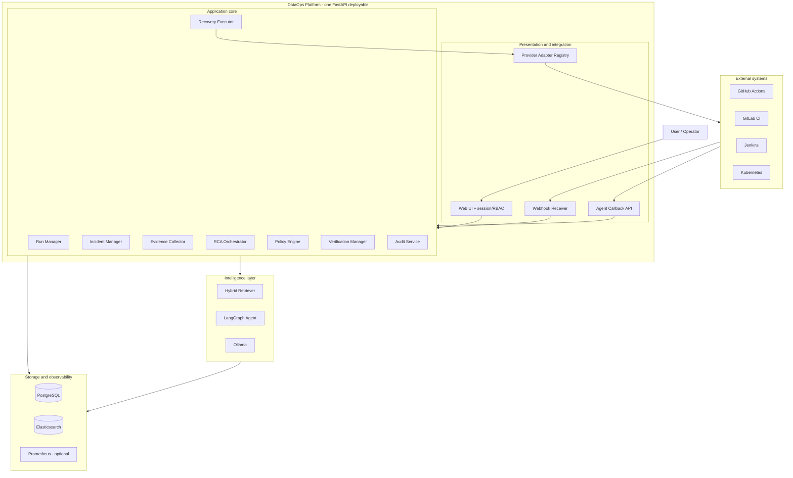

# 2. Kiến trúc hệ thống

## 2.1 Nguyên tắc kiến trúc

1. **Provider-neutral core:** GitHub, GitLab và Jenkins chỉ xuất hiện trong adapter.
2. **Event-driven:** webhook/callback được chuẩn hóa thành internal event chung.
3. **Async by default:** CI không phải chờ LLM phân tích; queue ngoài chỉ thêm khi cần
   tải/concurrency, không là dependency kiến trúc bắt buộc.
4. **Capability-based:** mỗi provider khai báo khả năng thay vì bị ép có cùng tính năng.
5. **Safety boundary:** AI Agent lập kế hoạch; Policy Engine quyết định hành động có được phép; Executor mới thực thi.
6. **Verification required:** recovery chưa được xem là thành công nếu chưa chạy verification.
7. **Modular monolith trước:** FastAPI phục vụ Web UI và API trong một deployable; module
   vẫn tách theo domain để có thể tách service khi có nhu cầu đo được.
8. **Self-service:** onboarding project, token và provider phải thực hiện được trên Web UI,
   không yêu cầu sửa core hoặc thao tác database thủ công.

## 2.2 Các tầng hệ thống



## 2.3 Thành phần

### Web UI và Identity

- FastAPI render HTML và phục vụ static CSS/JavaScript trong MVP.
- Session cookie và RBAC tách biệt với Bearer token của CI/CD Agent.
- Quản lý user, workspace, project, provider integration và integration token.
- Dùng cùng application service với JSON API; UI không truy cập database trực tiếp.

Web UI là phần của image `dataops-platform`, nhưng đang là milestone kế tiếp chứ chưa có
trong backend M1–M6 hiện tại.

### Webhook Receiver

- Xác minh chữ ký webhook.
- Chống replay và ghi nhận `delivery_id`.
- Chuyển payload riêng của provider thành `NormalizedPipelineEvent`.
- Persist event và trả phản hồi nhanh; không chạy RCA dài trong request của provider.

### Run Manager

- Tạo/cập nhật `PipelineRun` và `StageRun`.
- Liên kết `external_run_id` với `run_id` nội bộ.
- Quản lý state transition hợp lệ.
- Chống tạo dữ liệu trùng.

### Incident Manager

- Tạo incident từ pipeline failure, Data Quality failure hoặc anomaly.
- Gom nhiều event liên quan vào cùng một incident.
- Quản lý trạng thái từ `DETECTED` đến `RESOLVED` hoặc `ESCALATED`.

### Evidence Collector

Thu thập có mục tiêu:

- Failed job log và stack trace.
- Git diff của commit gây lỗi.
- Data Quality/anomaly report.
- Image digest, version và deployment metadata.
- Metrics gần thời điểm xảy ra lỗi.
- Runbook và incident tương tự.

Evidence Collector không tải toàn bộ repository hoặc embedding toàn bộ log nếu không cần thiết.

### Hybrid Retriever

- BM25 cho error code, tên cột, function, job và exact term.
- Vector search cho runbook, incident summary và code chunk tương tự.
- Metadata filter theo project, provider, pipeline, error type và thời gian.
- Kết hợp kết quả bằng Reciprocal Rank Fusion (RRF).

### RCA Orchestrator

LangGraph điều phối các bước thu thập, truy xuất, kiểm tra đủ bằng chứng và gọi LLM. Output phải tuân theo schema thay vì văn bản tự do.

### Policy Engine

- Là thành phần deterministic, không phải LLM.
- So khớp loại incident, độ tin cậy, môi trường và requested action.
- Xác định `AUTO_APPROVED`, `REQUIRE_APPROVAL` hoặc `DENIED`.

### Recovery Executor

Thực hiện hành động thông qua provider adapter, không gọi trực tiếp SDK cụ thể từ core. Mọi execution đều có idempotency key, timeout và số lần retry giới hạn.

### Verification Manager

- Trigger workflow/job kiểm chứng.
- Đọc test và Data Quality result.
- So sánh lỗi trước/sau recovery.
- Chỉ đóng incident khi tiêu chí pass.

## 2.4 Phân tách dữ liệu

| Loại dữ liệu | Nơi lưu | Ghi chú |
|---|---|---|
| User, workspace, project, token metadata | PostgreSQL | Token chỉ lưu hash/prefix, credential mã hóa |
| Run, incident, plan, audit | PostgreSQL | Dữ liệu quan hệ và trạng thái |
| Log tìm kiếm | Elasticsearch | Có retention riêng |
| Runbook, incident summary, code chunk vector | Elasticsearch | Index tách biệt với log |
| Metrics | Prometheus | MTTD, MTTR, latency, resource |

Không vector hóa từng dòng log. Chỉ tạo embedding cho incident summary, runbook và code chunk đã được chọn lọc.

Object storage và Redis/Celery là khả năng mở rộng, không là dependency bắt buộc của bản
self-hosted đầu tiên. Chỉ thêm khi artifact lớn hoặc workload nền/concurrency chứng minh cần
queue bền vững; PostgreSQL vẫn là nguồn dữ liệu trạng thái chính.

## 2.5 Topology triển khai

### Self-hosted MVP

```text
Server DataOps
├── reverse proxy/TLS
├── dataops-platform (FastAPI API + Web UI)
├── PostgreSQL
├── Elasticsearch
└── Kibana tùy chọn cho operator

External/private endpoint
└── Ollama: gemma4:e2b + bge-m3:567m

CI execution host
└── GitHub-hosted hoặc self-hosted runner + DataOps Agent
```

`docker compose up -d` là golden path cài đặt. Chỉ reverse proxy public Web UI, callback
API và webhook cần thiết; database/search/model không public.

### Topology mở rộng ba server

```text
Server A — CI/CD
├── GitHub self-hosted runner hoặc Jenkins
├── Docker
└── CI integration client

Server B — Runtime
├── K3s/Kubernetes
├── Pipeline Job
├── Verification Job
├── Prometheus/Grafana
└── Elastic Agent

Server C — DataOps
├── FastAPI API + Web UI
├── PostgreSQL
├── Elasticsearch/Kibana
├── Ollama + LangGraph
└── Policy/Recovery services
```

Celery/Redis, MinIO và worker riêng chỉ xuất hiện ở topology mở rộng khi có yêu cầu tải,
artifact hoặc isolation cụ thể; chúng không phải điều kiện để dùng Platform.

## 2.6 Ranh giới tin cậy

- Payload bên ngoài luôn phải được xác thực và validate schema.
- Browser dùng session cookie/CSRF; Agent dùng token theo project/integration; provider
  webhook dùng signature. Không dùng một credential cho ba trust boundary này.
- Log có thể chứa secret hoặc dữ liệu cá nhân; phải redact trước khi đưa vào LLM.
- LLM không được nhận token CI/CD, Kubernetes credential hoặc database password.
- Recovery Executor dùng credential tách riêng và quyền tối thiểu.
- Raw data bất biến; pipeline ghi vào staging và chỉ publish sau verification.
- Tất cả quyết định, approval và hành động được ghi audit log.
