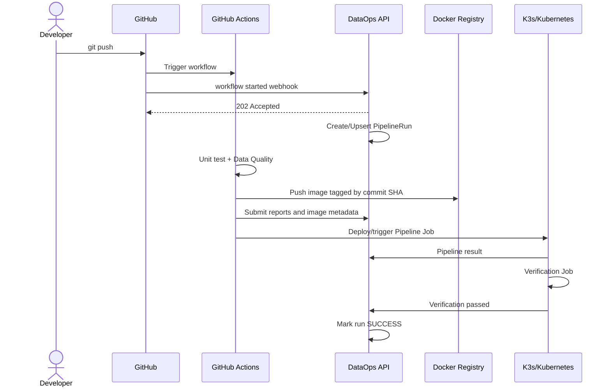
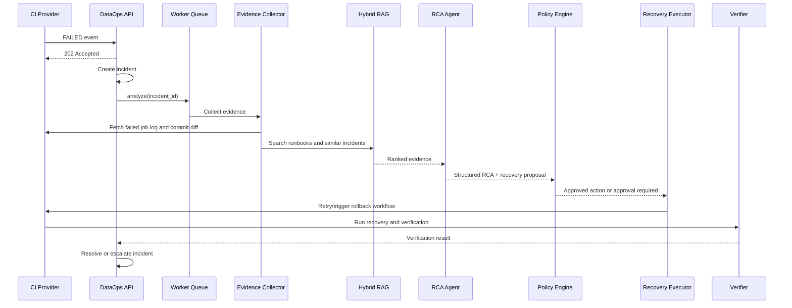
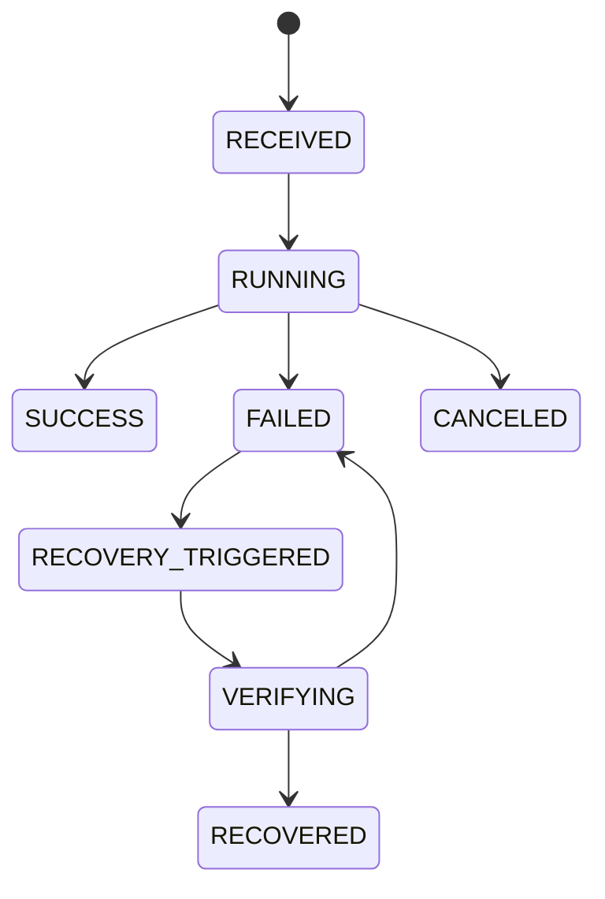
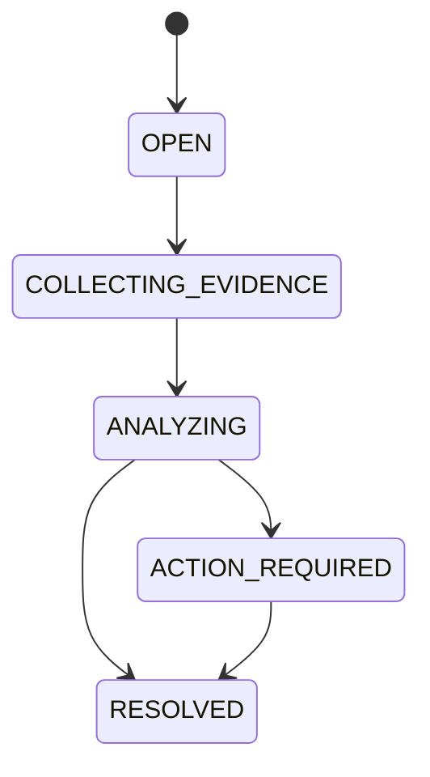

# 3. Luồng hoạt động

## 3.1 Điều kiện trước khi chạy

Một project phải được đăng ký với:

- `project_id` nội bộ.
- Repository và provider.
- Workflow/pipeline được theo dõi.
- Credential hoặc GitHub App installation có quyền tối thiểu.
- Data Quality command và verification command.
- Image registry/repository.
- Recovery policy áp dụng cho project.

## 3.2 Push code và pipeline thành công

Happy path không gọi AI Agent. Webhook và callback chỉ thêm overhead nhỏ; report lớn được upload trực tiếp vào object storage hoặc xử lý bất đồng bộ.

## 3.3 Pipeline thất bại

## 3.4 State machine của pipeline run

## 3.5 State machine của incident

M1 đã triển khai việc tạo idempotent Incident ở trạng thái `OPEN`. Các transition còn
lại do Evidence/RCA/Recovery service điều khiển; không client nào được tự ý ghi trực tiếp
trạng thái Incident. M2 đã triển khai `OPEN → COLLECTING_EVIDENCE → ANALYZING` khi có
failed-stage logs, hoặc `ACTION_REQUIRED` khi log storage lỗi/không có log phù hợp.

## 3.6 Ví dụ schema drift

1. Developer đổi `customer_id` thành `user_id` nhưng chưa sửa downstream mapping.
2. GitHub Actions chạy Data Quality test và phát hiện schema mismatch.
3. DataOps nhận `FAILED`, tạo incident và lấy đúng job log.
4. Evidence Collector lấy Git diff của commit và report schema.
5. Hybrid RAG tìm runbook “schema drift” và incident tương tự.
6. Agent tạo RCA với bằng chứng rằng field đã bị rename.
7. Policy Engine cho phép `QUARANTINE` hoặc `ROLLBACK_IMAGE`; `CREATE_PR` cần phê duyệt.
8. Executor trigger recovery workflow dùng image ổn định trước đó.
9. Verification Job kiểm tra schema, record count và output.
10. Incident chỉ được đóng nếu verification pass.

## 3.7 Retry và chống lặp vô hạn

- Mỗi recovery plan có `max_attempts`.
- Cùng một action và cùng một target version dùng chung idempotency key.
- Lỗi không đổi sau một lần retry phải được nâng mức xử lý.
- Agent không tự tạo kế hoạch mới vô hạn.
- Incident thiếu bằng chứng hoặc có confidence thấp được chuyển sang `ESCALATED`.

## 3.8 Khi nào CI phải chờ?

CI chỉ chờ các quality gate bắt buộc như unit test, Data Quality và verification trước publish. CI không chờ RCA Agent. Khi lỗi xảy ra, DataOps trả `202 Accepted`, phân tích ở background và trigger một recovery run riêng.
