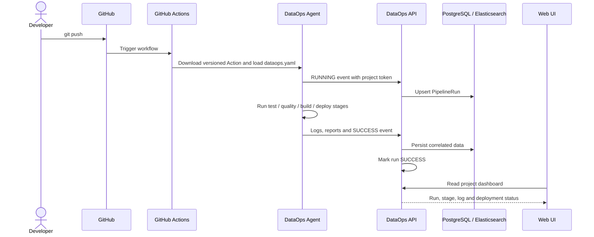
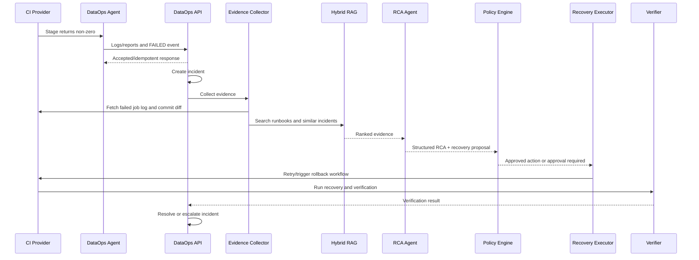
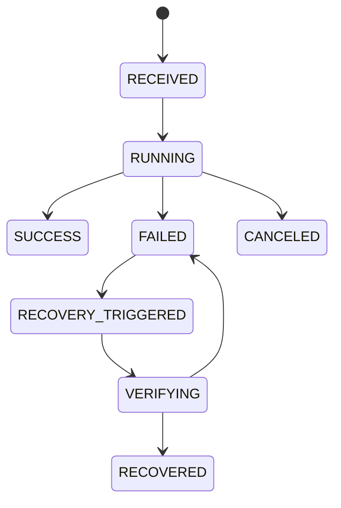
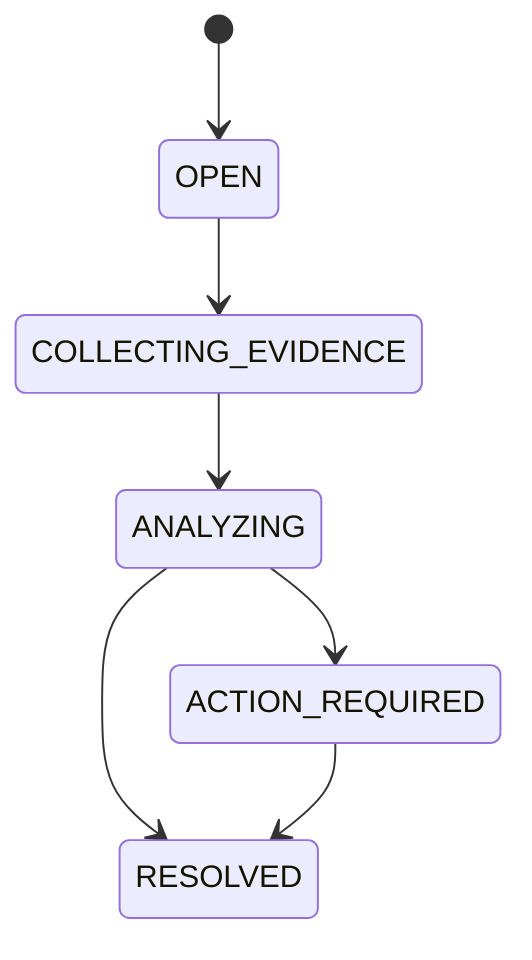

# 3. Luồng hoạt động

## 3.1 User bắt đầu sử dụng

```text
Chạy bộ Docker Compose
→ mở Web UI và bootstrap owner
→ tạo Workspace
→ tạo Project
→ kết nối repository/provider
→ tạo integration token
→ Web UI sinh GitHub Actions snippet
→ lưu endpoint/token vào GitHub Secrets
→ commit workflow
→ chạy pipeline đầu tiên
```

Ở phiên bản hiện tại, API dùng một `DATAOPS_AGENT_TOKEN` cấp instance và chưa có Web UI.
Kiến trúc đích thay token dùng chung bằng token hash theo project/integration trước khi hỗ
trợ nhiều workspace.

## 3.2 Điều kiện trước khi chạy

Một project phải được đăng ký với:

- `workspace_id` và thành viên có role phù hợp.
- `project_id` nội bộ.
- Repository và provider.
- Workflow/pipeline được theo dõi.
- Integration token cho chiều Agent → Platform.
- Credential hoặc GitHub App installation có quyền tối thiểu.
- Data Quality command và verification command.
- Image registry/repository.
- Recovery policy áp dụng cho project.

## 3.3 Push code và pipeline thành công



Happy path không gọi RCA Agent. Callback retry có giới hạn và mặc định không đổi exit code
của test/build/deploy nếu Platform tạm unavailable. Report lớn có thể chuyển sang object
storage ở giai đoạn sau; report MVP được validate, giới hạn kích thước và lưu theo run.

## 3.4 Pipeline thất bại



## 3.5 State machine của pipeline run



## 3.6 State machine của incident



M1 đã triển khai việc tạo idempotent Incident ở trạng thái `OPEN`. Các transition còn
lại do Evidence/RCA/Recovery service điều khiển; không client nào được tự ý ghi trực tiếp
trạng thái Incident. M2 đã triển khai `OPEN → COLLECTING_EVIDENCE → ANALYZING` khi có
failed-stage logs, hoặc `ACTION_REQUIRED` khi log storage lỗi/không có log phù hợp.

## 3.7 Ví dụ schema drift

1. Developer đổi `customer_id` thành `user_id` nhưng chưa sửa downstream mapping.
2. GitHub Actions chạy Data Quality test và phát hiện schema mismatch.
3. DataOps nhận `FAILED`, tạo incident và lấy đúng job log.
4. Evidence Collector lấy Git diff của commit và report schema.
5. Hybrid RAG tìm runbook “schema drift” và incident tương tự.
6. Agent tạo RCA với bằng chứng rằng field đã bị rename.
7. Policy Engine cho phép `QUARANTINE` hoặc `ROLLBACK_IMAGE`; `CREATE_PR` cần phê duyệt.
8. Executor trigger recovery workflow dùng image ổn định trước đó.
9. Verification Job kiểm tra schema, record count và output.
10. Incident chỉ được đóng nếu verification pass.

## 3.8 Retry và chống lặp vô hạn

- Mỗi recovery plan có `max_attempts`.
- Cùng một action và cùng một target version dùng chung idempotency key.
- Lỗi không đổi sau một lần retry phải được nâng mức xử lý.
- Agent không tự tạo kế hoạch mới vô hạn.
- Incident thiếu bằng chứng hoặc có confidence thấp được chuyển sang `ESCALATED`.

## 3.9 Platform chủ động chạy hoặc recovery

Chiều Agent → Platform dùng integration token. Chiều Platform → provider dùng GitHub App
hoặc provider credential riêng:

```text
User bấm Run/Rerun/Approve
→ FastAPI kiểm tra session, RBAC và policy
→ Provider Adapter kiểm tra capability
→ GitHub API trigger workflow
→ runner chạy workflow mới
→ DataOps Agent gửi run mới về
→ verification callback cập nhật attempt
```

Hai credential này không được dùng lẫn và không được gửi vào prompt LLM.

## 3.10 Khi nào CI phải chờ?

CI chỉ chờ các quality gate bắt buộc như unit test, Data Quality và verification trước publish. CI không chờ RCA Agent. Khi lỗi xảy ra, DataOps trả `202 Accepted`, phân tích ở background và trigger một recovery run riêng.
