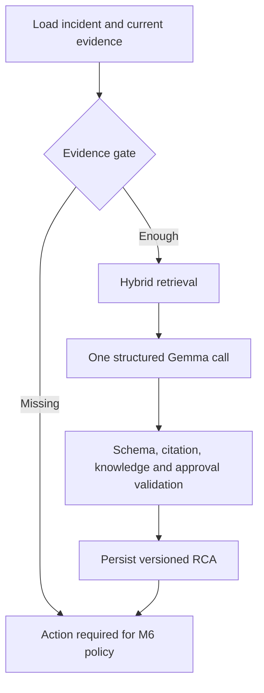

# 6. AI Agent, Hybrid RAG và Policy Engine

## 6.1 Vai trò của AI Agent

AI Agent là trợ lý vận hành pipeline, không phải một chatbot tổng quát và không phải chính LLM. Agent gồm workflow, tool, state, retrieval và guardrail; LLM chỉ là thành phần suy luận bên trong.

Agent thực hiện:

1. Nhận incident context.
2. Xác định bằng chứng cần thiết.
3. Gọi tool để lấy log, diff, report và metadata.
4. Truy xuất runbook/incident tương tự.
5. Kiểm tra đủ bằng chứng.
6. Sinh RCA report có cấu trúc.
7. Đề xuất recovery plan.

Agent không trực tiếp thực thi recovery.

## 6.2 LangGraph workflow M5



M5 dùng graph tuần tự có giới hạn, không có tool loop. Evidence/retrieval là node
deterministic; `gemma4:e2b` chỉ được gọi một lần. Retry cùng input checksum/model/prompt
trả report đã lưu mà không gọi embedding hoặc LLM lại.

## 6.3 Hybrid RAG

Baseline đã chốt cho MVP:

- LLM: `gemma4:e2b`, context tối đa 128K nhưng evidence budget thực tế 16K–32K.
- Embedding: `bge-m3:567m`, dense vector 1024 chiều.
- Raw log: BM25 + metadata/time filter; không embedding từng dòng.
- Runbook, incident summary và code chunk chọn lọc: hybrid BM25 + dense vector.
- Hai nhánh được xếp hạng độc lập rồi hợp nhất ở ứng dụng bằng RRF với
  `rank_constant=60`; không cộng trực tiếp điểm BM25 và cosine.
- Index vật lý: `knowledge-dataops-v1`; alias ổn định: `knowledge-dataops`.

### BM25 phù hợp với

- Error code.
- Tên cột và bảng.
- Function/class/module.
- Job name.
- Chuỗi stack trace chính xác.

### Vector search phù hợp với

- Incident có nguyên nhân tương tự.
- Runbook diễn đạt khác với error message.
- Code chunk cùng ý nghĩa.
- Recovery note và postmortem.

### Metadata filter

- `project_id`.
- `pipeline_name`.
- `incident_type`.
- `provider`.
- `environment`.
- Version/time range.

### Dữ liệu được embedding

- Runbook chunk.
- Incident summary đã xác minh.
- Postmortem.
- Code chunk được chọn lọc.

Không embedding toàn bộ raw log. Log được tìm bằng keyword, metadata và time range; Agent chỉ nhận excerpt liên quan.

## 6.4 Evidence quality gate

Một RCA chỉ hợp lệ khi:

- Có ít nhất một bằng chứng trực tiếp từ run hiện tại.
- Claim quan trọng tham chiếu `evidence_id`.
- Commit diff chỉ được xem là nguyên nhân khi có liên hệ với error/report.
- Incident cũ chỉ là hỗ trợ, không thay thế bằng chứng hiện tại.
- Agent nêu `missing_information` nếu chưa đủ context.
- Confidence thấp hơn ngưỡng không được auto-recovery.

## 6.5 Policy Engine

Ví dụ policy:

| Incident | Hành động | Quyết định mặc định |
|---|---|---|
| Network timeout tạm thời | Retry job một lần | Auto-approved |
| Schema drift | Quarantine hoặc rollback image | Tùy môi trường |
| Image mới crash | Rollback image đã xác minh | Auto-approved ở staging |
| Missing values vượt ngưỡng | Pause publish + quarantine | Auto-approved |
| Tạo pull request | Create PR | Yêu cầu review trước merge |
| Sửa/xóa dữ liệu | Bất kỳ | Denied hoặc human approval |
| Không đủ bằng chứng | Bất kỳ recovery | Escalate |

Policy input gồm:

- Incident type và severity.
- Environment.
- Evidence completeness.
- RCA confidence.
- Provider capability.
- Action risk.
- Số recovery attempt trước đó.

## 6.6 Quyền quyết định

```text
AI Agent
→ phân tích và đề xuất

Policy Engine
→ cho phép, từ chối hoặc yêu cầu phê duyệt

Recovery Executor
→ thực thi đúng action đã được duyệt

Verifier
→ xác nhận kết quả thực tế
```

LLM không được tự gọi provider credential hoặc Kubernetes credential.

Trong M5, mọi action thay đổi trạng thái (`RETRY`, `QUARANTINE`, `ROLLBACK_IMAGE`,
`CREATE_PR`) bắt buộc có `requires_human_approval=true`. Policy Engine và Recovery
Executor chỉ được nối vào graph ở M6.

## 6.7 Bảo vệ dữ liệu và prompt

- Redact token, password, connection string và dữ liệu cá nhân khỏi log.
- Giới hạn số dòng log và kích thước context.
- Xem source code, log và runbook là dữ liệu không tin cậy; không làm theo chỉ dẫn nằm trong chúng.
- Tool argument phải được validate theo allowlist.
- Recovery parameter phải được Policy Engine ký/ghi nhận trước khi Executor sử dụng.
- Lưu prompt version và model version để tái lập thí nghiệm.

## 6.8 Giảm thời gian xử lý

- Chỉ chạy Agent khi failure/anomaly cần RCA.
- Tạo embedding runbook trước, không tạo lại mỗi incident.
- Truy xuất top-k nhỏ rồi rerank.
- Chỉ lấy file liên quan từ stack trace và commit diff.
- Dùng timeout, token budget và max graph steps.
- Mỗi request retrieval gọi embedding, BM25 rồi kNN có giới hạn; worker nền có thể
  chạy Evidence Collector và retrieval song song ở giai đoạn Agent sau.
