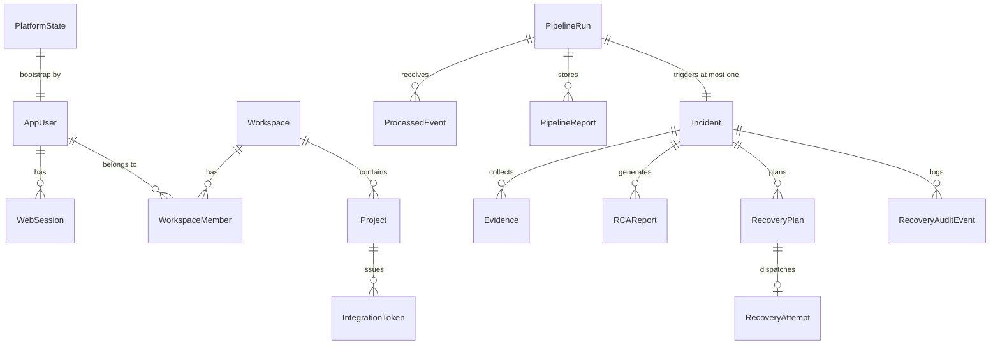
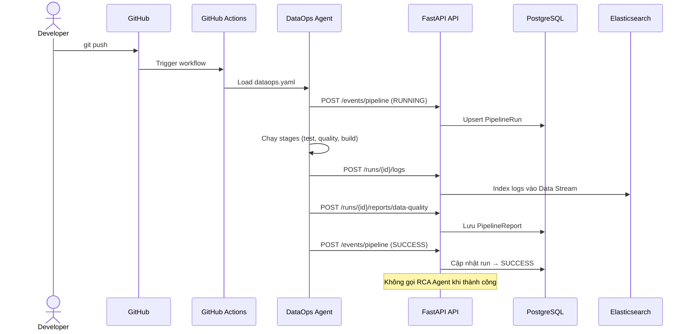
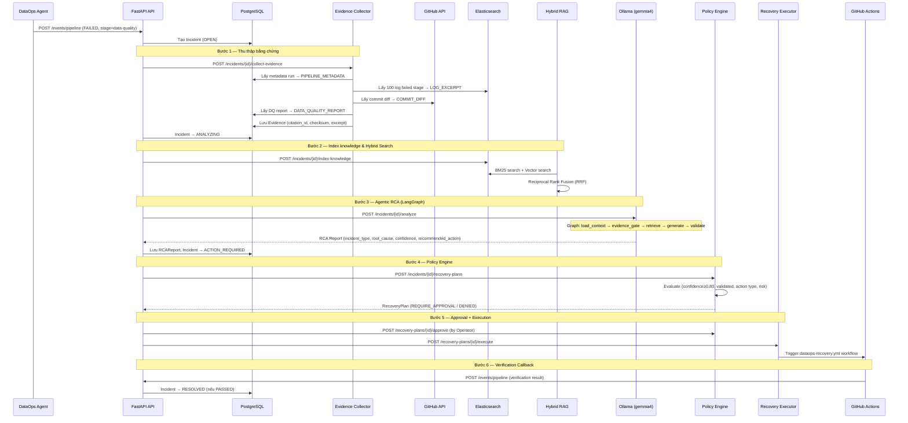
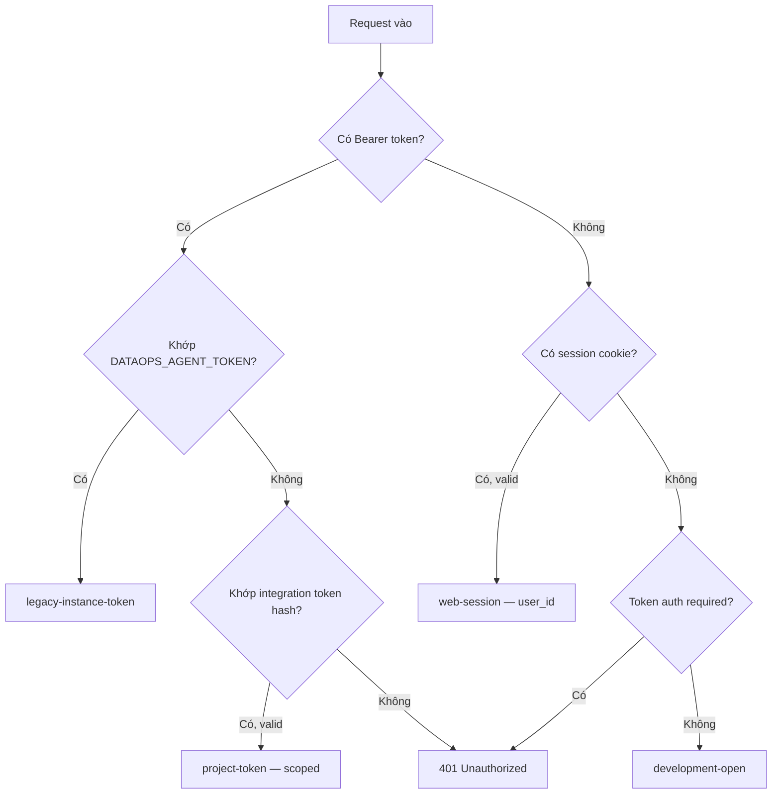

# DataOps Control Plane — Phân tích Hệ thống & Ý tưởng Môi trường Test Ảo

## Phần 1: Công nghệ (Tech Stack)

### 1.1 Backend & Web UI

| Layer | Công nghệ | Vai trò |
|---|---|---|
| **Framework** | FastAPI (Python 3.11+) | API server + server-rendered Web UI |
| **Template** | Jinja2 + HTML/CSS/JavaScript | Web UI dựng trên server-side rendering |
| **Validation** | Pydantic, Pydantic Settings | Validate schema đầu vào/đầu ra, config |
| **ORM / Database** | SQLModel (SQLAlchemy) + PostgreSQL | Domain model persistence |
| **Search / Logging** | Elasticsearch 9.4.4 + Kibana 9.4.4 | Pipeline logs (Data Stream), knowledge index (vector + BM25) |
| **AI / LLM** | LangGraph + Ollama (`gemma4:e2b`) | Agentic RCA (Root Cause Analysis) workflow |
| **Embedding** | Ollama (`bge-m3:567m`, 1024 dims) | Vector embedding cho Hybrid Retrieval (RRF) |
| **HTTP Client** | httpx | Gọi GitHub API, Ollama API |
| **Package Manager** | uv (hatchling build) | Dependency management, lock file |
| **Container** | Docker (multi-stage), Docker Compose | Runtime packaging |
| **CI/CD** | GitHub Actions | Build, test, Trivy scan, publish GHCR/DockerHub |
| **Testing** | pytest, pytest-cov, ruff | Unit/integration tests, linting |

### 1.2 Kiến trúc Module (Source Code)

```
src/dataops_control_plane/
├── main.py                    # FastAPI app factory (create_app)
├── config.py                  # Pydantic Settings (env vars)
├── domain/
│   └── models.py              # 14 SQLModel tables
├── api/
│   ├── schemas.py             # Pydantic request/response schemas
│   ├── dependencies.py        # DI: auth, session, services
│   └── routes/                # 13 route modules
│       ├── events.py          # Pipeline event ingestion
│       ├── incidents.py       # Incident CRUD + evidence + RCA
│       ├── logs.py            # Pipeline log ingestion/search
│       ├── recovery.py        # Recovery plan/approve/execute
│       ├── retrieval.py       # Hybrid RAG document + search
│       ├── runs.py            # Pipeline run read
│       ├── web_auth.py        # Bootstrap, login, session
│       ├── web_members.py     # User/member management
│       ├── web_onboarding.py  # GitHub onboarding snippets
│       ├── web_projects.py    # Project CRUD, tokens
│       ├── web_tokens.py      # Integration token management
│       └── web_ui.py          # Dashboard, project, run, incident pages
├── services/                  # 20 service modules
│   ├── pipeline_events.py     # Event processing logic
│   ├── pipeline_logs.py       # Log store interface
│   ├── elasticsearch_logs.py  # ES Data Stream implementation
│   ├── elasticsearch_knowledge.py # ES knowledge index
│   ├── evidence.py            # Evidence Collector
│   ├── github_evidence.py     # GitHub commit diff collector
│   ├── retrieval.py           # Hybrid Retriever (BM25 + vector → RRF)
│   ├── ollama_embeddings.py   # Ollama embedding provider
│   ├── rca_agent.py           # LangGraph RCA Agent (5-node graph)
│   ├── ollama_rca.py          # Ollama LLM client for RCA
│   ├── recovery_policy.py     # Deterministic Policy Engine
│   ├── recovery_execution.py  # Provider-neutral Recovery Executor
│   ├── github_recovery.py     # GitHub Actions write adapter
│   ├── recovery_audit.py      # Audit trail
│   ├── web_identity.py        # Session/user management
│   ├── web_members.py         # Member CRUD
│   └── web_projects.py        # Project service
└── web/
    ├── static/                # app.css, app.js
    └── templates/             # Jinja2: base, dashboard, incident, login, project, run, setup
```

### 1.3 Domain Models (14 bảng PostgreSQL)



---

## Phần 2: Luồng Hoạt động (Runtime Flow)

### 2.1 Luồng Happy Path (Pipeline Thành Công)



### 2.2 Luồng Failure → Incident → RCA → Recovery



### 2.3 LangGraph RCA Agent (5-node graph)


| Node | Chức năng |
|---|---|
| `load_context` | Lấy PipelineRun + Evidence từ DB |
| `evidence_gate` | Kiểm tra phải có PIPELINE_METADATA + ít nhất 1 diagnostic evidence |
| `retrieve` | Hybrid search (BM25 + vector RRF) trên knowledge index |
| `generate` | Gọi Ollama với JSON Schema, system prompt phòng injection |
| `validate` | Validate output schema, kiểm tra citation_id và knowledge_id hợp lệ |

### 2.4 Hệ thống xác thực & phân quyền



---

## Phần 3: Ý tưởng Tạo Môi Trường Test Ảo

### 3.1 Phương án 1: **Docker Compose Test Environment** (Khuyến nghị nhất)

> [!TIP]
> Đây là phương án thực tế nhất — tận dụng `compose.yaml` có sẵn, chỉ cần thêm mock services.

**Ý tưởng**: Tạo một `compose.test.yaml` override chứa tất cả dependencies giả lập:

```yaml
# compose.test.yaml
services:
  api:
    environment:
      DATAOPS_AGENT_TOKEN: "test-token-12345"
      DATAOPS_LLM_URL: http://mock-ollama:11434
      DATAOPS_EMBEDDING_URL: http://mock-ollama:11434
      DATAOPS_GITHUB_API_URL: http://mock-github:8080
      DATAOPS_GITHUB_TOKEN: "fake-github-token"
      DATAOPS_GITHUB_RECOVERY_TOKEN: "fake-recovery-token"
  
  mock-ollama:
    build: ./test-env/mock-ollama
    # Trả response cố định cho embedding + RCA generation
  
  mock-github:
    build: ./test-env/mock-github
    # Giả lập GitHub API: commit diff, workflow dispatch
  
  test-agent:
    build: ./test-env/test-agent
    # Giả lập DataOps Agent gửi events/logs/reports
    depends_on:
      api:
        condition: service_healthy
```

**Các mock cần xây dựng:**

| Mock Service | Giả lập | Endpoints |
|---|---|---|
| **mock-ollama** | Ollama API | `POST /api/embed` → vector 1024d cố định; `POST /api/chat` → RCA JSON chuẩn |
| **mock-github** | GitHub REST API | `GET /repos/{owner}/{repo}/compare` → diff cố định; `POST /repos/{owner}/{repo}/actions/workflows/{id}/dispatches` → 204 |
| **test-agent** | DataOps Agent | Script Python gửi tuần tự: RUNNING event → logs → DQ report → FAILED event |
| **test-scenario-runner** | E2E orchestrator | Chạy full flow: event → incident → evidence → RCA → recovery → verify |

### 3.2 Phương án 2: **Pytest Integration Test Suite mở rộng** (Unit + Integration)

> [!NOTE]
> Repo đã có 22 test files chạy với SQLite in-memory. Có thể mở rộng thành full integration suite.

**Hiện tại đã có:**
- ✅ SQLite in-memory thay PostgreSQL
- ✅ `create_app(engine=..., log_store=..., evidence_sources=..., ...)` → inject mock dependencies
- ✅ `TestClient` (sync ASGI test) cho mọi API endpoint

**Cần bổ sung:**

```python
# tests/conftest.py — Shared fixtures
@pytest.fixture
def full_platform():
    """Khởi tạo toàn bộ platform với mock services."""
    engine = create_engine("sqlite://", ...)
    mock_log_store = InMemoryLogStore()
    mock_evidence = [StaticEvidenceSource()]
    mock_retriever = FixedRetriever(documents=[...])
    mock_rca = StaticRCAClient(response={...})
    mock_executor = RecordingRecoveryExecutor()
    
    app = create_app(
        engine=engine,
        log_store=mock_log_store,
        evidence_sources=mock_evidence,
        hybrid_retriever=mock_retriever,
        rca_agent=RCAAgent(mock_retriever, mock_rca),
        recovery_executor=mock_executor,
    )
    return TestClient(app)

@pytest.fixture
def seeded_incident(full_platform):
    """Tạo sẵn incident với evidence cho test."""
    # 1. Bootstrap owner
    # 2. Login → session
    # 3. Tạo workspace + project + token
    # 4. Gửi RUNNING + FAILED event
    # 5. Collect evidence
    return incident_id
```

**Test scenarios cần viết:**

| Scenario | Mục đích |
|---|---|
| `test_e2e_happy_path` | Event RUNNING → logs → report → SUCCESS → không tạo incident |
| `test_e2e_failure_to_rca` | FAILED → incident → evidence → analyze → RCA report |
| `test_e2e_recovery_approved` | RCA → plan → approve → execute → verification callback → RESOLVED |
| `test_e2e_recovery_denied` | Low confidence → plan DENIED → không thực thi |
| `test_e2e_duplicate_idempotency` | Double event, double evidence, double RCA → tất cả idempotent |
| `test_e2e_web_operator_flow` | Login → dashboard → incident detail → approve recovery trên UI |
| `test_e2e_multi_project_isolation` | 2 projects, mỗi token chỉ thấy pipeline của mình |

### 3.3 Phương án 3: **Web-based Test Simulator** (Interactive Demo)

> [!IMPORTANT]
> Tạo một web app giả lập toàn bộ CI/CD flow, cho phép click từng bước và xem hệ thống phản ứng.

**Concept:** Một Single-Page App (chạy trên cổng riêng) kết nối real API của DataOps Platform:

```
┌─────────────────────────────────────────────────┐
│          DataOps Test Simulator                  │
├─────────────────────────────────────────────────┤
│ [Scenario] ▼ Schema Drift   [▶ Run Scenario]    │
│                                                  │
│ Timeline:                                        │
│ ● Step 1: Push code          [Done ✓]           │
│ ● Step 2: RUNNING event      [Done ✓]           │
│ ● Step 3: Send logs          [Done ✓]           │
│ ● Step 4: Send DQ report     [Done ✓]           │
│ ● Step 5: FAILED event       [Running...]       │
│ ○ Step 6: Collect evidence   [Pending]          │
│ ○ Step 7: RCA Analysis       [Pending]          │
│ ○ Step 8: Recovery Plan      [Pending]          │
│ ○ Step 9: Approve & Execute  [Pending]          │
│ ○ Step 10: Verification      [Pending]          │
│                                                  │
│ ┌─── API Response ────────────────────────────┐ │
│ │ POST /api/v1/events/pipeline                │ │
│ │ Status: 202                                  │ │
│ │ {"event_id":"...", "run_id":"...",           │ │
│ │  "duplicate": false, "run_status":"FAILED"} │ │
│ └──────────────────────────────────────────────┘ │
│                                                  │
│ [DataOps Dashboard ↗]  [Incident Detail ↗]      │
└─────────────────────────────────────────────────┘
```

**Scenarios đóng gói sẵn:**

1. **Schema Drift** — Customer_id → user_id, DQ check fail
2. **Amount Range Violation** — Giá trị ngoài khoảng cho phép
3. **Build Failure** — Docker build lỗi
4. **Network Timeout** — Stage timeout, retry thành công
5. **Happy Path** — Tất cả pass, không tạo incident

### 3.4 Phương án 4: **GitHub Actions Mock Runner**

> [!WARNING]
> Phức tạp hơn nhưng test sát thực tế nhất — giả lập chính CI/CD runner.

**Ý tưởng**: Sử dụng [act](https://github.com/nektos/act) hoặc tự build một mock runner:

```bash
# Chạy GitHub Actions workflow locally với act
act -W .github/workflows/dataops.yml \
    --env DATAOPS_URL=http://localhost:8000 \
    --env DATAOPS_TOKEN=test-token \
    --secret DATAOPS_TOKEN=test-token
```

Hoặc tạo script Python mô phỏng chính xác hành vi của `dataops-agent`:

```python
# test-env/simulate_agent.py
class DataOpsAgentSimulator:
    """Giả lập chính xác luồng mà dataops-agent@v0 thực hiện."""
    
    async def run_scenario(self, scenario: Scenario):
        # 1. Gửi RUNNING event
        await self.send_event("pipeline.started", status="RUNNING")
        
        # 2. Chạy từng stage theo dataops.yaml
        for stage in scenario.stages:
            logs = stage.generate_logs()
            await self.send_logs(logs)
            
            if stage.has_report:
                await self.send_report(stage.report)
        
        # 3. Gửi completion event
        if scenario.should_fail:
            await self.send_event("pipeline.completed", 
                                   status="FAILED",
                                   failed_stage=scenario.fail_stage)
        else:
            await self.send_event("pipeline.completed", status="SUCCESS")
```

### 3.5 So sánh các phương án

| Tiêu chí | Docker Compose Mock | Pytest Mở rộng | Web Simulator | Act Runner |
|---|---|---|---|---|
| **Độ phức tạp setup** | ⭐⭐ Trung bình | ⭐ Thấp | ⭐⭐⭐ Cao | ⭐⭐⭐ Cao |
| **Sát thực tế** | ⭐⭐⭐ Rất cao | ⭐⭐ Cao | ⭐⭐ Trung bình | ⭐⭐⭐ Rất cao |
| **Tốc độ chạy** | ⭐⭐ Trung bình | ⭐⭐⭐ Rất nhanh | ⭐⭐ Trung bình | ⭐ Chậm |
| **CI/CD compatible** | ✅ Có | ✅ Có | ❌ Khó | ⚠️ Có nhưng nặng |
| **Demo/Trình bày** | ⚠️ Cần terminal | ❌ Không visual | ✅ Rất trực quan | ❌ Không visual |
| **Regression testing** | ✅ Tốt | ✅ Rất tốt | ⚠️ Manual | ⚠️ Chậm |
| **Cần Ollama thật** | ❌ Mock | ❌ Mock | Tùy chọn | Tùy chọn |
| **Cần Elasticsearch** | ✅ Real (compose) | ❌ Mock | ✅ Real | ✅ Real |

---

## Phần 4: Khuyến nghị

> [!IMPORTANT]
> ### Chiến lược kết hợp (Khuyến nghị)

**Tầng 1 — Unit/Integration (luôn chạy):**
- Mở rộng pytest suite hiện tại với E2E test scenarios
- SQLite in-memory + mock services → chạy trong < 30s
- Chạy trong CI trên mỗi PR

**Tầng 2 — Docker Compose Full Stack (chạy định kỳ):**
- `compose.test.yaml` với mock-ollama + mock-github
- Test toàn bộ stack thật (PostgreSQL + Elasticsearch + FastAPI)
- Chạy nightly hoặc trước release

**Tầng 3 — Web Simulator (demo/trình bày):**
- Xây một web app đơn giản để trình bày luận văn
- Click-through từng bước, hiển thị API calls và responses
- Kết nối real platform đang chạy local

Bạn muốn tôi bắt tay vào xây dựng phương án nào trước?
